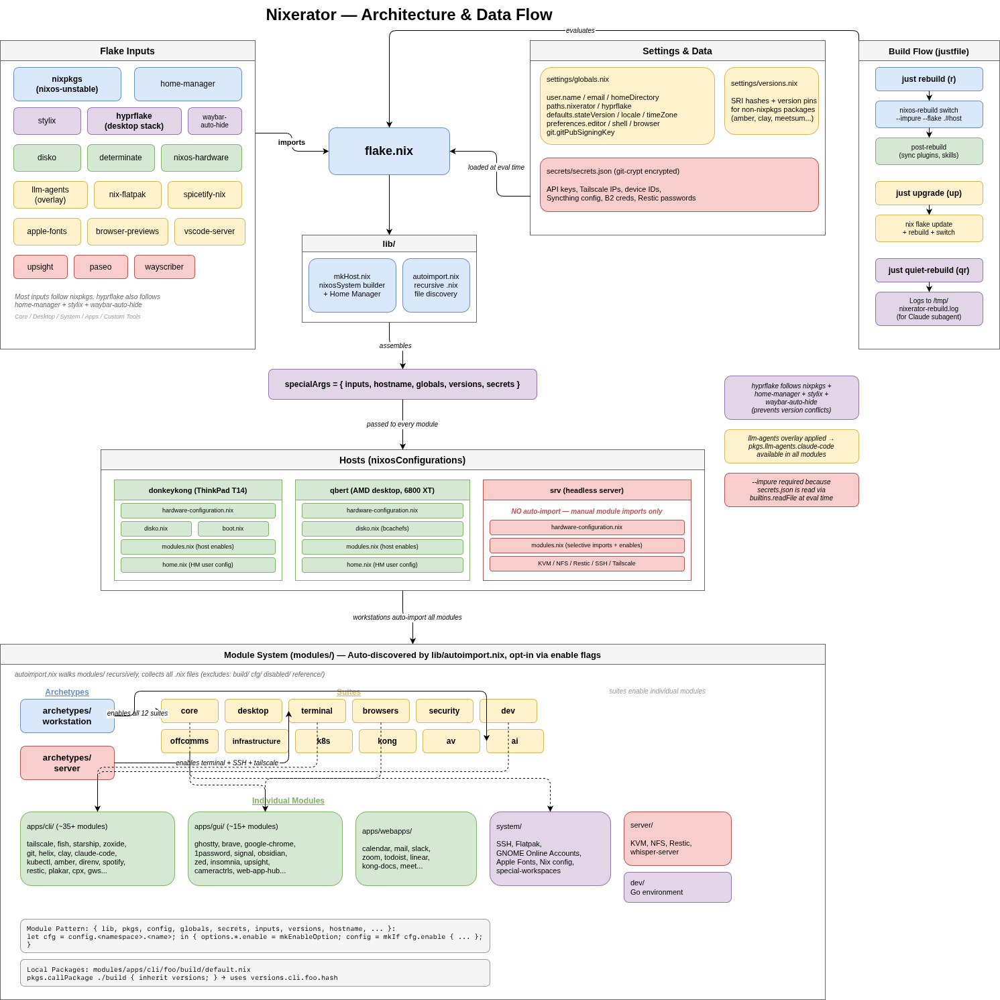

# Nixerator

Modular NixOS configuration with flakes, home-manager, and a Hyprland desktop
running the DankMaterialShell (DMS) shell.

## Architecture



## Status

Ever changing.

## Quick Start

### New System Installation

```bash
# See detailed installation guide
cat extras/docs/bootstrap.txt
```

### Update Existing System

```bash
cd ~/git/nixerator
sudo nixos-rebuild switch --impure --flake .#HOSTNAME
```

## Common Commands

```bash
# Using justfile
just switch          # Rebuild and switch
just update          # Update flake inputs
just clean           # Garbage collect
just generations     # List generations

# Direct nix commands
sudo nixos-rebuild switch --impure --flake .#HOSTNAME
nix flake update
nix-collect-garbage -d
```

## Configuration

**Global settings**: `settings/globals.nix`
Username, timezone, locale, editor preferences

**Host-specific**: `hosts/HOSTNAME/configuration.nix`
Enable modules via options:

```nix
{
  apps.cli.git.enable = true;
  apps.gui.google-chrome.enable = true;
  suites.dev.enable = true;  # Enable entire suite
}
```

## Documentation

- **[Architecture](extras/docs/architecture.md)** - Directory structure, modules, and design principles
- **[Module Development](extras/docs/module-development.md)** - Creating new modules
- **[Adding Hosts](extras/docs/adding-hosts.md)** - Adding a new NixOS host
- **[Hosts Reference](extras/docs/hosts.md)** - Active hosts and their configs
- **[Commands](extras/docs/commands.md)** - Justfile recipes and common commands
- **[Secrets](extras/docs/secrets.md)** - 1Password-only secrets (vault: `nixerator`); fetched via `just render-secrets` + `just fetch-signatures`
- **[Bootstrap](extras/docs/bootstrap.txt)** - NixOS installation guide
- **[VM Development](extras/docs/vm-development.md)** - Development VM setup
- **[Web Apps](extras/docs/webapps.md)** - Progressive web application modules

## Module Categories

```shell
modules/
├── apps/
│   ├── cli/          # Command-line tools
│   ├── gui/          # Graphical applications
│   └── webapps/      # Progressive web apps
├── suites/           # Grouped module collections
├── system/           # System configuration
└── dev/              # Development environments
```

Enable individually or by suite:

```nix
# Individual apps
apps.cli.git.enable = true;

# Or enable entire suite
suites.dev.enable = true;
```

## Desktop

- The desktop configuration is an external repo for the Hyprland desktop: [bashfulrobot/hyprflake](https://github.com/bashfulrobot/hyprflake)
- The desktop shell is **DankMaterialShell (DMS)** — bar, launcher,
  notifications, OSD, power menu, lock, and idle in one process. hyprflake is
  DMS-first, and the previous Waybar-based stack has been retired. The desktop
  suite (`modules/suites/desktop`) wires it via `hyprflake.*` options.
- DMS reads its settings once at startup, so the rebuild recipes
  (`just rebuild` / `just upgrade` and their quiet variants) restart
  `dms.service` automatically after activation.
