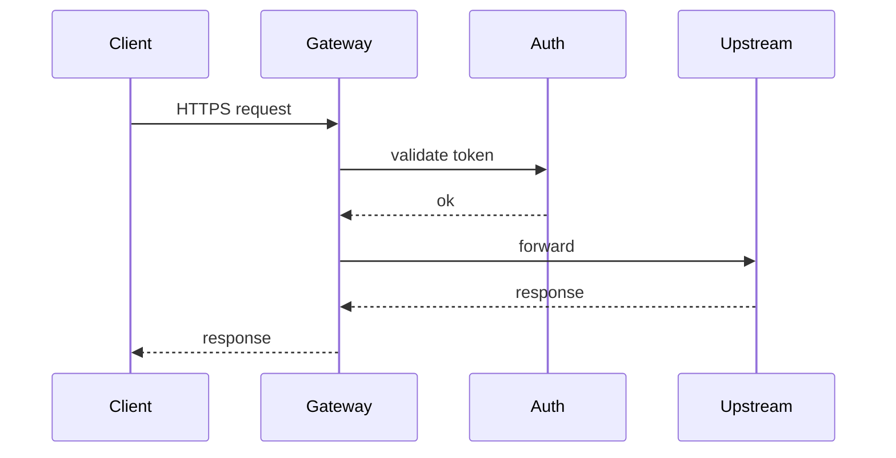

# Markdown authoring guide

A Slidev deck is a single `slides.md` file. Each `---` (with optional frontmatter) starts a new slide.

> **Theme scope.** General Slidev syntax (separators, frontmatter rules,
> code blocks, click animations, transitions) applies to both bundled
> themes. Layout names, slot syntax, and frontmatter props differ per
> theme — examples below assume the **Kong** theme. For **Neversink**,
> see `references/neversink.md` (different layouts, `:: name ::` slots
> with mandatory blank lines, `color:` colour-scheme system, components
> like `<StickyNote>` / `<AdmonitionType>`).

## Anatomy

```markdown
---
# Deck-level frontmatter (only on the FIRST slide)
theme: default
title: My Deck Title
transition: fade
mdc: true
fonts:
  sans: 'Funnel Sans'
  serif: 'Funnel Display'
  mono: 'JetBrains Mono'

# Layout-specific props (cover layout reads these from configs)
eyebrow: KONG QBR
speaker: Dustin Krysak
date: APRIL 2026
tagline: One short sentence.
---

# Cover slide content goes here

---
# Per-slide frontmatter
layout: section
eyebrow: WHY THIS MATTERS
---

# A bold statement.

<!-- speaker note for this slide -->
```

The first slide implicitly uses the `cover` layout if you set the four cover props in deck frontmatter.

## Frontmatter rules

- The very first frontmatter block applies to the entire deck **and** the first slide.
- Each subsequent frontmatter block applies to that slide only.
- YAML quoting: wrap any value containing a colon, hash, or other YAML special character in single or double quotes.
- Lists of objects are written `[{key: value, key2: value2}]` or as nested `-` lists.

## Slide separators

A line of three dashes `---` separates slides. If frontmatter follows, place it immediately after the dashes (no blank line):

```markdown
content of slide N

---
layout: section
---

# Slide N+1
```

## Speaker notes

Speaker notes are HTML comments placed **after** the slide content (or after the frontmatter if there's no body). They appear in presenter mode but not on the slide itself.

```markdown
---
layout: content
title: Roadmap
---

- Q2: Konnect EU
- Q3: Mesh 2.0
- Q4: AI Gateway GA

<!--
Walk through each item. Mention the EU rollout dependencies for Q2.
-->
```

## Bullets

Standard markdown bullets render as Kong-square lime markers automatically.

```markdown
- First point
- Second point
  - Sub-point indents two spaces
```

## Two-column

Use the `two-cols` layout and Slidev's named slots:

```markdown
---
layout: two-cols
title: Before / after
---

::left::

Content for the left column.

::right::

Content for the right column.
```

## Inline emphasis

- `**bold**` -> bold (Funnel Sans 600).
- `_italic_` -> italic; on the `section` layout this renders the text in lime, used for accent words.
- `` `code` `` -> inline code in the JetBrains Mono mono stack with an olive-green pill.

## Code blocks

Triple-backtick fenced blocks get Shiki syntax highlighting:

````markdown
```ts
export interface Plugin {
  name: string
  version: string
}
```
````

Slidev features inside code blocks:

- Highlight specific lines: ` ```ts {1,3-4} `
- Line-by-line reveal with `v-click`: ` ```ts {1|2|3} `
- Diff highlighting: ` ```diff `

## Stats

The `stats` layout reads an `items` array from frontmatter (the body is ignored):

```markdown
---
layout: stats
title: Platform scale
items:
  - { value: '700B+', label: 'API calls', note: 'Per month' }
  - { value: '60K+', label: 'Stars' }
  - { value: '100+', label: 'Plugins' }
footer: Trusted by enterprises across 32 industries.
---
```

## Team

```markdown
---
layout: team
people:
  - { name: 'Jane Doe', title: 'VP Engineering', image: '/jane.png' }
  - { name: 'John Smith', title: 'Director, Platform' }
---
```

Drop headshots into `public/` and reference them as `/filename.png`. If `image` is omitted, the slot shows an empty olive tile.

## Images

Either use the `image` layout for a side-by-side text-and-image slide, or drop a markdown image inline:

```markdown

```

Images live in `public/`. The image layout adds a lime border and rounded corners; inline markdown images do not.

## Click animations

Reveal content step-by-step:

```markdown
- <v-click>First reveal</v-click>
- <v-click>Second reveal</v-click>
- <v-click>Third</v-click>
```

Or wrap a group:

```markdown
<v-clicks>

- One
- Two
- Three

</v-clicks>
```

## Transitions

Deck default is `fade` (matches the PPTX template feel). Override per slide:

```markdown
---
layout: content
transition: slide-left
---
```

Common transitions: `fade`, `slide-left`, `slide-up`, `view-transition`. Set `transition: none` on a slide that should snap.

## Hidden slides

Add `hide: true` to keep a slide in the file but skip it during presentation. Useful for backup/appendix material:

```markdown
---
layout: content
hide: true
title: Backup detail
---
```

## Patterns

### QBR / EBR cover

```markdown
---
theme: default
eyebrow: KONG QBR
speaker: Dustin Krysak, Staff Technical CSM
date: APRIL 2026
tagline: Quarterly business review for Acme Corp.
---

# Acme x Kong<br/>Q1 2026
```

### Section divider with accent word

```markdown
---
layout: section
eyebrow: THE PROBLEM
---

# APIs are everywhere. Governance is _nowhere._
```

### Stats grid (signature Kong slide)

```markdown
---
layout: stats
title: What we're seeing
eyebrow: BY THE NUMBERS
items:
  - { value: '4x', label: 'API growth YoY' }
  - { value: '60%', label: 'Of breaches start at the API layer' }
  - { value: '12mo', label: 'Avg. time to detect a leaked key' }
footer: The status quo isn't holding.
---
```

### Quote / customer voice

```markdown
---
layout: quote
attribution: VP Platform, Fortune 100 retailer
---

> Kong's the only vendor where we can govern, secure, and observe
> every API in one place - including the AI agents.
```

### Closing

```markdown
---
layout: closing
contact: dustin@konghq.com
url: konghq.com
---

# Thank you!
```

## Slidev core features (theme-agnostic)

Everything below works in **both** the Kong and Neversink themes. These
are Slidev built-ins worth reaching for — most decks underuse them.

### Magic Move (animated code transitions)

The killer feature for any code-heavy talk. Wrap a sequence of code blocks
in a fenced ` ```md magic-move ` container and Slidev animates the diff
between them on click — variables move into place, lines slide in, removed
lines fade out. Each inner block is one click step.

````markdown
````md magic-move

```ts
const x = 1
```

```ts
const x = 1
const y = 2
```

```ts
const x = 1
const y = 2
const z = x + y
```

````
````

Use this for: walking through a config evolution (basic gateway → add
auth → add rate-limiting), API design changes, plugin chain composition,
refactoring demos, before/after code comparisons. Vastly more legible than
"old code on left, new code on right".

### Click-stepped reveals (`v-click` / `v-clicks`)

Reveal content one step at a time. Pair with `class="kong-fader"` (Kong
theme) or `ns-c-fader` (Neversink) to fade prior items.

```markdown
<v-clicks>

- Edge — TLS terminates here
- Auth — OIDC / mTLS plugin chain
- Policy — rate-limit, ACL, transforms
- Routing — service / route match

</v-clicks>
```

Single-element variant:

```markdown
<v-click>

This appears on click 1.

</v-click>

<v-click at="3">

This appears on click 3 (skipping 2).

</v-click>
```

For code blocks, line-by-line reveal is built into Shiki:

````markdown
```ts {1|2|3-4|all}
const gateway = new Gateway()
gateway.use(auth)
gateway.use(rateLimit)
gateway.use(transform)
```
````

### `v-drag` (free-form positioning)

Position any element absolutely on the slide. The directive accepts
`[x, y, width, height]` (height can be `'auto'`). In `slidev dev`, you can
drag elements live and Slidev writes the coords back into the markdown.

```markdown
<KongStickyNote v-drag="[820, 200, 260, 'auto']">
A floating aside.
</KongStickyNote>

<KongBox label="Auth boundary" v-drag="[140, 140, 360, 200]" />


```

This is the foundation of all overlay annotations on the `full` layout.

### Mermaid diagrams

Architecture flowcharts, sequence diagrams, ERDs — drop in as fenced
` ```mermaid ` blocks. Slidev renders them client-side via Mermaid.js.

````markdown

````

Common diagram types: `flowchart`, `sequenceDiagram`, `classDiagram`,
`erDiagram`, `stateDiagram-v2`, `gantt`. The output respects light/dark
backgrounds; for dark themes (Kong, or Neversink dark mode) Mermaid will
pick contrasting colours automatically.

### TwoSlash (typed code with hover info)

For TypeScript code, append `twoslash` to the fence and Slidev runs the
TS compiler so hover-over shows real types:

````markdown
```ts twoslash
const config = {
  port: 8000,
  plugins: ['rate-limiting', 'oauth2'],
}
//    ^?
```
````

Useful for SDK / API / config walk-throughs where the type is the point.

### Useful built-in components

Slidev ships these globally — no import needed:

- `<Arrow x1="..." y1="..." x2="..." y2="..." />` — annotation arrow
  (Kong theme also wraps this as `<KongArrow>` with lime defaults).
- `<Link to="42">jump</Link>` — clickable internal slide jump.
- `<Toc />` — auto table of contents from your `# headings`.
- `<AutoFitText :max="180" :min="40">Big text</AutoFitText>` — text that
  scales to fit the container.
- `<Tweet id="..." />` / `<Youtube id="..." />` / `<SlidevVideo>` — embeds.
- `<LightOrDark>` — render different content in light vs dark mode.
- `<Transform :scale="0.5" :rotate="15">…</Transform>` — wrap with CSS
  transforms.

### Drawings (presenter mode whiteboard)

Press `d` during presentation to draw on slides. Persist with
`drawings.persist: true` in the deck frontmatter. Useful for live
annotation during architecture walkthroughs.

### Iframes (live demos)

Embed a live URL as a slide:

```markdown
---
layout: iframe
url: https://docs.konghq.com
---
```

For ad-hoc embedding inside any slide:

```markdown
<iframe src="https://example.com" class="w-full h-96" />
```

---

## Pitfalls

- **Forgot the `theme: ...` line** -> Slidev falls back to the default theme and the layouts won't load. Always include it in the deck frontmatter (`theme: default` for Kong since the layouts live in the project; `theme: neversink` for Neversink).
- **YAML colons** -> wrap titles containing `:` in quotes, e.g. `title: "Konnect: A guided tour"`.
- **Wrong slot syntax** -> the Kong theme uses `::left::` / `::right::` (double colons, no spaces); Neversink uses `:: left ::` / `:: right ::` (double colons WITH spaces and mandatory blank lines around). Don't mix the two.
- **Image not loading** -> assets must live in `public/` and be referenced as absolute paths starting with `/`.
- **Magic Move not animating** -> the fence must be `` ```md magic-move `` (with the `md` language tag), and the inner blocks must use the **same** language tag (all `ts`, or all `js`, etc.). Mixing languages breaks the diff.
- **`v-drag` coords drifting** -> the editor in `slidev dev` writes coords back into the markdown, but only when you save from the slide. If you reload before saving, edits are lost.
- **Editable PPTX expectation** -> Slidev's PPTX export embeds image-rendered slides. For editable PPTX use the `kong-pptx-build` skill.
