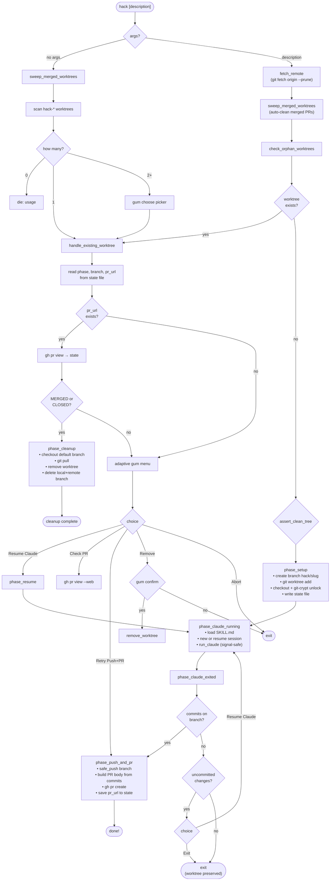
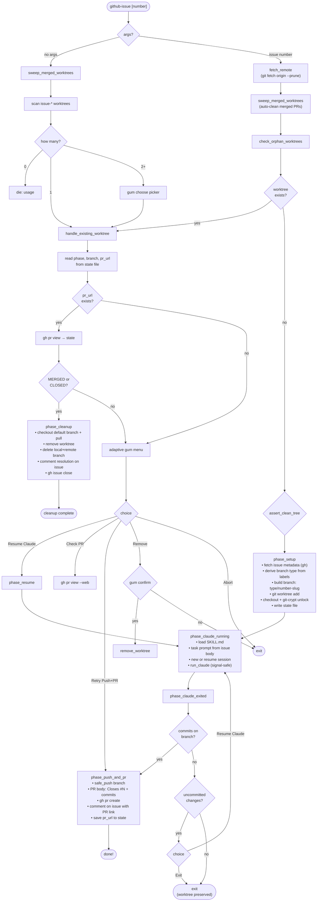

## Hack Workflow

```mermaid
flowchart TD
    START(["hack [description]"]) --> ARGS{args?}

    %% No-arg picker path
    ARGS -- "no args" --> SWEEP_P["sweep_merged_worktrees"]
    SWEEP_P --> SCAN["scan hack-* worktrees"]
    SCAN --> COUNT{how many?}
    COUNT -- "0" --> DIE_USAGE["die: usage"]
    COUNT -- "1" --> HANDLE_EXISTING
    COUNT -- "2+" --> GUM_PICK["gum choose picker"]
    GUM_PICK --> HANDLE_EXISTING

    %% With-arg main path
    ARGS -- "description" --> FETCH["fetch_remote\n(git fetch origin --prune)"]
    FETCH --> SWEEP["sweep_merged_worktrees\n(auto-clean merged PRs)"]
    SWEEP --> ORPHAN["check_orphan_worktrees"]
    ORPHAN --> WT_EXISTS{worktree\nexists?}

    %% Existing worktree
    WT_EXISTS -- "yes" --> HANDLE_EXISTING
    HANDLE_EXISTING["handle_existing_worktree"] --> READ_STATE["read phase, branch, pr_url\nfrom state file"]
    READ_STATE --> HAS_PR{pr_url\nexists?}
    HAS_PR -- "yes" --> CHECK_PR_API["gh pr view → state"]
    CHECK_PR_API --> PR_DONE{MERGED or\nCLOSED?}
    PR_DONE -- "yes" --> CLEANUP
    PR_DONE -- "no" --> MENU
    HAS_PR -- "no" --> MENU
    MENU["adaptive gum menu"] --> MENU_CHOICE{choice}
    MENU_CHOICE -- "Resume Claude" --> RESUME
    MENU_CHOICE -- "Check PR" --> OPEN_PR["gh pr view --web"]
    MENU_CHOICE -- "Retry Push+PR" --> PUSH_PR
    MENU_CHOICE -- "Remove" --> CONFIRM_RM{"gum confirm"}
    CONFIRM_RM -- "yes" --> REMOVE_WT["remove_worktree"]
    CONFIRM_RM -- "no" --> ABORT
    MENU_CHOICE -- "Abort" --> ABORT(["exit"])

    %% New worktree path
    WT_EXISTS -- "no" --> CLEAN{"assert_clean_tree"}
    CLEAN --> SETUP["phase_setup\n• create branch hack/slug\n• git worktree add\n• checkout + git-crypt unlock\n• write state file"]
    SETUP --> CLAUDE

    %% Claude session
    CLAUDE["phase_claude_running\n• load SKILL.md\n• new or resume session\n• run_claude (signal-safe)"]
    RESUME["phase_resume"] --> CLAUDE
    CLAUDE --> EXITED

    %% Post-Claude checks
    EXITED["phase_claude_exited"] --> COMMITS{commits on\nbranch?}
    COMMITS -- "yes" --> PUSH_PR
    COMMITS -- "no" --> DIRTY{uncommitted\nchanges?}
    DIRTY -- "yes" --> DIRTY_MENU{choice}
    DIRTY_MENU -- "Resume Claude" --> CLAUDE
    DIRTY_MENU -- "Exit" --> PRESERVE(["exit\n(worktree preserved)"])
    DIRTY -- "no" --> PRESERVE

    %% Push and PR
    PUSH_PR["phase_push_and_pr\n• safe_push branch\n• build PR body from commits\n• gh pr create\n• save pr_url to state"]
    PUSH_PR --> DONE(["done!"])

    %% Cleanup
    CLEANUP["phase_cleanup\n• checkout default branch\n• git pull\n• remove worktree\n• delete local+remote branch"]
    CLEANUP --> DONE_CLEAN(["cleanup complete"])
```

## GitHub Issue Workflow

```mermaid
flowchart TD
    START(["github-issue [number]"]) --> ARGS{args?}

    %% No-arg picker path
    ARGS -- "no args" --> SWEEP_P["sweep_merged_worktrees"]
    SWEEP_P --> SCAN["scan issue-* worktrees"]
    SCAN --> COUNT{how many?}
    COUNT -- "0" --> DIE_USAGE["die: usage"]
    COUNT -- "1" --> HANDLE_EXISTING
    COUNT -- "2+" --> GUM_PICK["gum choose picker"]
    GUM_PICK --> HANDLE_EXISTING

    %% With-arg main path
    ARGS -- "issue number" --> FETCH["fetch_remote\n(git fetch origin --prune)"]
    FETCH --> SWEEP["sweep_merged_worktrees\n(auto-clean merged PRs)"]
    SWEEP --> ORPHAN["check_orphan_worktrees"]
    ORPHAN --> WT_EXISTS{worktree\nexists?}

    %% Existing worktree
    WT_EXISTS -- "yes" --> HANDLE_EXISTING
    HANDLE_EXISTING["handle_existing_worktree"] --> READ_STATE["read phase, branch, pr_url\nfrom state file"]
    READ_STATE --> HAS_PR{pr_url\nexists?}
    HAS_PR -- "yes" --> CHECK_PR_API["gh pr view → state"]
    CHECK_PR_API --> PR_DONE{MERGED or\nCLOSED?}
    PR_DONE -- "yes" --> CLEANUP
    PR_DONE -- "no" --> MENU
    HAS_PR -- "no" --> MENU
    MENU["adaptive gum menu"] --> MENU_CHOICE{choice}
    MENU_CHOICE -- "Resume Claude" --> RESUME
    MENU_CHOICE -- "Check PR" --> OPEN_PR["gh pr view --web"]
    MENU_CHOICE -- "Retry Push+PR" --> PUSH_PR
    MENU_CHOICE -- "Remove" --> CONFIRM_RM{"gum confirm"}
    CONFIRM_RM -- "yes" --> REMOVE_WT["remove_worktree"]
    CONFIRM_RM -- "no" --> ABORT
    MENU_CHOICE -- "Abort" --> ABORT(["exit"])

    %% New worktree path
    WT_EXISTS -- "no" --> CLEAN{"assert_clean_tree"}
    CLEAN --> SETUP["phase_setup\n• fetch issue metadata (gh)\n• derive branch type from labels\n• build branch: type/number-slug\n• git worktree add\n• checkout + git-crypt unlock\n• write state file"]
    SETUP --> CLAUDE

    %% Claude session
    CLAUDE["phase_claude_running\n• load SKILL.md\n• task prompt from issue body\n• new or resume session\n• run_claude (signal-safe)"]
    RESUME["phase_resume"] --> CLAUDE
    CLAUDE --> EXITED

    %% Post-Claude checks
    EXITED["phase_claude_exited"] --> COMMITS{commits on\nbranch?}
    COMMITS -- "yes" --> PUSH_PR
    COMMITS -- "no" --> DIRTY{uncommitted\nchanges?}
    DIRTY -- "yes" --> DIRTY_MENU{choice}
    DIRTY_MENU -- "Resume Claude" --> CLAUDE
    DIRTY_MENU -- "Exit" --> PRESERVE(["exit\n(worktree preserved)"])
    DIRTY -- "no" --> PRESERVE

    %% Push and PR
    PUSH_PR["phase_push_and_pr\n• safe_push branch\n• PR body: Closes #N + commits\n• gh pr create\n• comment on issue with PR link\n• save pr_url to state"]
    PUSH_PR --> DONE(["done!"])

    %% Cleanup
    CLEANUP["phase_cleanup\n• checkout default branch + pull\n• remove worktree\n• delete local+remote branch\n• comment resolution on issue\n• gh issue close"]
    CLEANUP --> DONE_CLEAN(["cleanup complete"])
```

## Dependabot Workflow

```mermaid
flowchart TD
    START(["dependabot [alert-number]"]) --> ARGS{args?}

    %% No-arg picker path
    ARGS -- "no args" --> SWEEP_P["sweep_merged_worktrees"]
    SWEEP_P --> SCAN_WT["scan dependabot-* worktrees"]
    SCAN_WT --> FETCH_ALERTS["fetch open alerts\n(gh api dependabot/alerts)"]
    FETCH_ALERTS --> BUILD_MENU["build combined menu:\n• [active] existing worktrees\n• open alerts (skip dupes)"]
    BUILD_MENU --> EMPTY{any items?}
    EMPTY -- "0" --> NO_ALERTS(["no alerts, exit"])
    EMPTY -- "1+" --> GUM_PICK["gum choose picker"]
    GUM_PICK --> PICK_TYPE{selection type}
    PICK_TYPE -- "worktree" --> HANDLE_EXISTING
    PICK_TYPE -- "alert" --> MAIN_FLOW

    %% With-arg main path
    ARGS -- "alert number" --> MAIN_FLOW
    MAIN_FLOW["main()"] --> FETCH_META["fetch alert metadata\n(gh api)"]
    FETCH_META --> FETCH["fetch_remote\n(git fetch origin --prune)"]
    FETCH --> SWEEP["sweep_merged_worktrees\n(auto-clean merged PRs)"]
    SWEEP --> ORPHAN["check_orphan_worktrees"]
    ORPHAN --> WT_EXISTS{worktree\nexists?}

    %% Existing worktree
    WT_EXISTS -- "yes" --> HANDLE_EXISTING
    HANDLE_EXISTING["handle_existing_worktree"] --> READ_STATE["read phase, branch, pr_url\nfrom state file"]
    READ_STATE --> HAS_PR{pr_url\nexists?}
    HAS_PR -- "yes" --> CHECK_PR_API["gh pr view → state"]
    CHECK_PR_API --> PR_DONE{MERGED or\nCLOSED?}
    PR_DONE -- "yes" --> CLEANUP
    PR_DONE -- "no" --> MENU
    HAS_PR -- "no" --> MENU
    MENU["adaptive gum menu"] --> MENU_CHOICE{choice}
    MENU_CHOICE -- "Resume Claude" --> RESUME
    MENU_CHOICE -- "Check PR" --> OPEN_PR["gh pr view --web"]
    MENU_CHOICE -- "Retry Push+PR" --> PUSH_PR
    MENU_CHOICE -- "Remove" --> CONFIRM_RM{"gum confirm"}
    CONFIRM_RM -- "yes" --> REMOVE_WT["remove_worktree"]
    CONFIRM_RM -- "no" --> ABORT
    MENU_CHOICE -- "Abort" --> ABORT(["exit"])

    %% New worktree path
    WT_EXISTS -- "no" --> CLEAN{"assert_clean_tree"}
    CLEAN --> SETUP["phase_setup\n• validate alert is open\n• extract pkg, CVE, GHSA, versions\n• branch: security/N-pkg-slug\n• git worktree add\n• checkout + git-crypt unlock\n• save alert JSON for context\n• write state file"]
    SETUP --> CLAUDE

    %% Claude session
    CLAUDE["phase_claude_running\n• load SKILL.md\n• rich task prompt:\n  pkg, manifest, CVE, GHSA,\n  vuln range, patched version\n• new or resume session\n• run_claude (signal-safe)"]
    RESUME["phase_resume"] --> CLAUDE
    CLAUDE --> EXITED

    %% Post-Claude checks
    EXITED["phase_claude_exited"] --> COMMITS{commits on\nbranch?}
    COMMITS -- "yes" --> PUSH_PR
    COMMITS -- "no" --> DIRTY{uncommitted\nchanges?}
    DIRTY -- "yes" --> DIRTY_MENU{choice}
    DIRTY_MENU -- "Resume Claude" --> CLAUDE
    DIRTY_MENU -- "Exit" --> PRESERVE(["exit\n(worktree preserved)"])
    DIRTY -- "no" --> PRESERVE

    %% Push and PR
    PUSH_PR["phase_push_and_pr\n• safe_push branch\n• PR title: security(pkg): fix ...\n• PR body: alert ref + commits\n• gh pr create\n• save pr_url to state"]
    PUSH_PR --> DONE(["done!"])

    %% Cleanup
    CLEANUP["phase_cleanup\n• checkout default branch + pull\n• remove worktree\n• delete local+remote branch\n• dismiss dependabot alert\n  (fix_started)"]
    CLEANUP --> DONE_CLEAN(["cleanup complete"])
```
